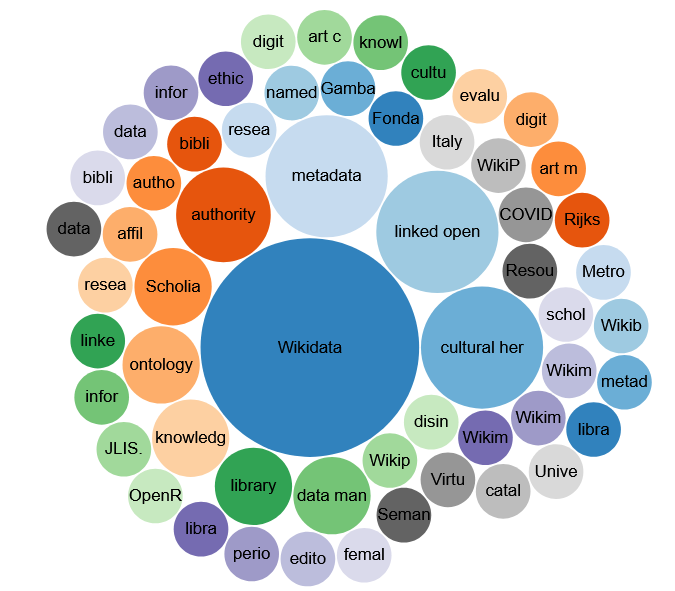

# Wikidata-review
This project includes supplementary material for the research work "A systematic review of Wikidata in GLAM institutions".

## Introduction
All the items analysed in this work have been included in Wikidata, when not available, using the [Scholia tool](https://scholia.toolforge.org/).
In total, 37 research articles and conferences were retrieved, most of them published in academic journals. The items have been annotated according to the [Taxonomy of Digital Research Activities in the Humanities (TADIRAH)]({https://vocabs.dariah.eu/tadirah/en/).

A SPARQL sentence to create a bubble chart describing the main subject describing the projects is shown below.

```
#defaultView:BubbleChart
SELECT (COUNT(?article) AS ?articles) ?mainSubject ?mainSubjectLabel ?mainSubjectDescription
WHERE { 
VALUES ?article {
    wd:Q104099847 wd:Q104150944 wd:Q103899610 wd:Q105592649 wd:Q96148694 
    wd:Q107308059 wd:Q105755620 wd:Q107806487 wd:Q122987257 wd:Q112054081 
    wd:Q115915949 wd:Q121966745 wd:Q122987597 wd:Q112031360 wd:Q112637240 
    wd:Q106474577 wd:Q112041345 wd:Q114389516 wd:Q122987572 wd:Q115055573 
    wd:Q111319831 wd:Q111589027 wd:Q110623130 wd:Q116940713 wd:Q117237722 
    wd:Q116810655 wd:Q122987586 wd:Q118894325 wd:Q115781260 wd:Q96831129 
    wd:Q92414206  wd:Q123114954 wd:Q112032533 wd:Q112768897 wd:Q116626368 
    wd:Q118240340 wd:Q122945951}.
  ?article wdt:P921 ?mainSubject.   
SERVICE wikibase:label { bd:serviceParam wikibase:language "en" }
} GROUP BY ?mainSubject ?mainSubjectLabel ?mainSubjectDescription
ORDER BY DESC(?articles)
```


## SPARQL Construct query
This query was used to extract the metadata describing the articles used in this work from Wikidata. The sentence can be run in the [publich Wikidata SPARQL endpoint](https://w.wiki/7rHP). 

```
CONSTRUCT {
  ?article wdt:P31 ?instance .
  ?article wdt:P1476 ?title .
  ?article wdt:P50 ?author .
  ?article wdt:P2093 ?authorName .
  ?article wdt:P407 ?language .
  ?article wdt:P577 ?date .
  ?article wdt:P1433 ?publishIn .
  ?article wdt:P356 ?doi .
  ?article wdt:P921 ?mainSubject
} 
WHERE {
    VALUES ?article {
    wd:Q104099847 wd:Q104150944 wd:Q103899610 wd:Q105592649 wd:Q96148694 
    wd:Q107308059 wd:Q105755620 wd:Q107806487 wd:Q122987257 wd:Q112054081 
    wd:Q115915949 wd:Q121966745 wd:Q122987597 wd:Q112031360 wd:Q112637240 
    wd:Q106474577 wd:Q112041345 wd:Q114389516 wd:Q122987572 wd:Q115055573 
    wd:Q111319831 wd:Q111589027 wd:Q110623130 wd:Q116940713 wd:Q117237722 
    wd:Q116810655 wd:Q122987586 wd:Q118894325 wd:Q115781260 wd:Q96831129
    wd:Q92414206  wd:Q123114954 wd:Q112032533 wd:Q112768897 wd:Q116626368 
    wd:Q118240340 wd:Q122945951}.
    
    ?article wdt:P31 ?instance .
    ?article wdt:P1476 ?title .
    OPTIONAL {?article wdt:P50 ?author .}
    OPTIONAL {?article wdt:P2093 ?authorName .}
    OPTIONAL {?article wdt:P407 ?language .}
    OPTIONAL {?article wdt:P577 ?date .}
    OPTIONAL {?article wdt:P1433 ?publishIn .}
    OPTIONAL {?article wdt:P356 ?doi .}
    OPTIONAL {?article wdt:P921 ?mainSubject .}
}
```

## Dataset
The dataset is provided in the folder `dataset` and includes 3 formats: CSV, JSON and TSV. These files have been retrieved and created from the public Wikidata SPARQL endpoint.

## References
- Gustavo Candela: An automatic data quality approach to assess semantic data from cultural heritage institutions. J. Assoc. Inf. Sci. Technol. 74(7): 866-878 (2023). https://doi.org/10.1002/asi.24761
- Fudie Zhao: A systematic review of Wikidata in Digital Humanities projects. Digit. Scholarsh. Humanit. 38(2): 852-874 (2023). https://doi.org/10.1093/llc/fqac083
- Marçal Mora Cantallops, Salvador Sánchez-Alonso, Elena García-Barriocanal: A systematic literature review on Wikidata. Data Technol. Appl. 53(3): 250-268 (2019). https://doi.org/10.1108/DTA-12-2018-0110
- Seyed Amir Hosseini Beghaeiraveri, Jose Emilio Labra-Gayo, Andra Waagmeester, Ammar Ammar, Carolina Gonzalez, Denise Slenter, Sabah Ul-Hasan, Egon L. Willighagen, Fiona McNeill, and Alasdair J G Gray. 2023. Wikidata subsetting: approaches, tools, and evaluation. Semantic Web (2023). https://www.semantic-web-journal.net/system/files/swj3491.pdf
- Finn Årup Nielsen, Daniel Mietchen, and Egon Willighagen. 2017. Scholia and scientometrics with Wikidata. In Scientometrics 2017. 237–259. https://doi.org/10.1007/978-3-319-70407-4_36
